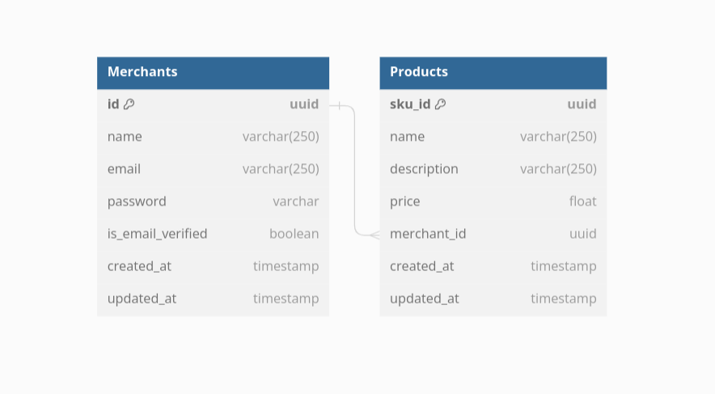

# SAL Backend Service

## Description
Backend Service for a fictional Sass company called SAL. SAL lists products from different merchants. 
To simplify their operation, they want merchants to be able to manage their product listing by themselves. 

## Installation

* Clone this repo

  ```bash
  git clone https://github.com/olad5/sal-backend-service.git
  ```
## Starting the Server

```bash
  make run
```


## Run tests

```bash
  make test.verbose
```

### ER diagram



### Design Assumptions
- What would inform your choice of a database when solving this particular problem? 
    - I would use a NoSQl database. Mongodb Specifically. A key-value store like S3 can also work.
    - Why Mongodb?
        - Mongodb is good at storing massive amount of data. 
        - It is also easier to auto scale mongodb as opposed to RDS which can 
        help prevent single point of failures. This high availability is very 
        crucial when having multiple merchants.
        - Also Databse sharding is relatively easier in Mongodb compared to RDS.

- How can you design the database for this particular problem for performance given that you have a large number of merchants? 
    - I would assume that over 5 years, 
        - the number of merchants will grow to 1k
        - each merchant will have products that are more than 10k.
    - So having 1k * 10k will equal to 10 million records.
    - With this in mind, I will have a unique products collection for every merchant. The collection
    name will be the in the format {merchant_id}_products.
    This will store all the products for that merchant because it will be more 
    effective to query a collection of 10k records as opposed to a 10 million records

